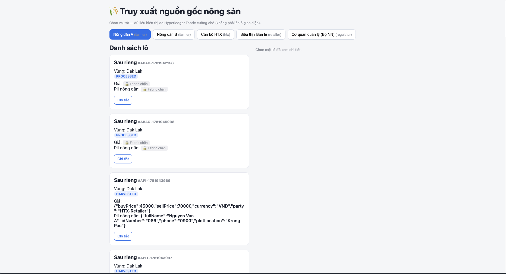
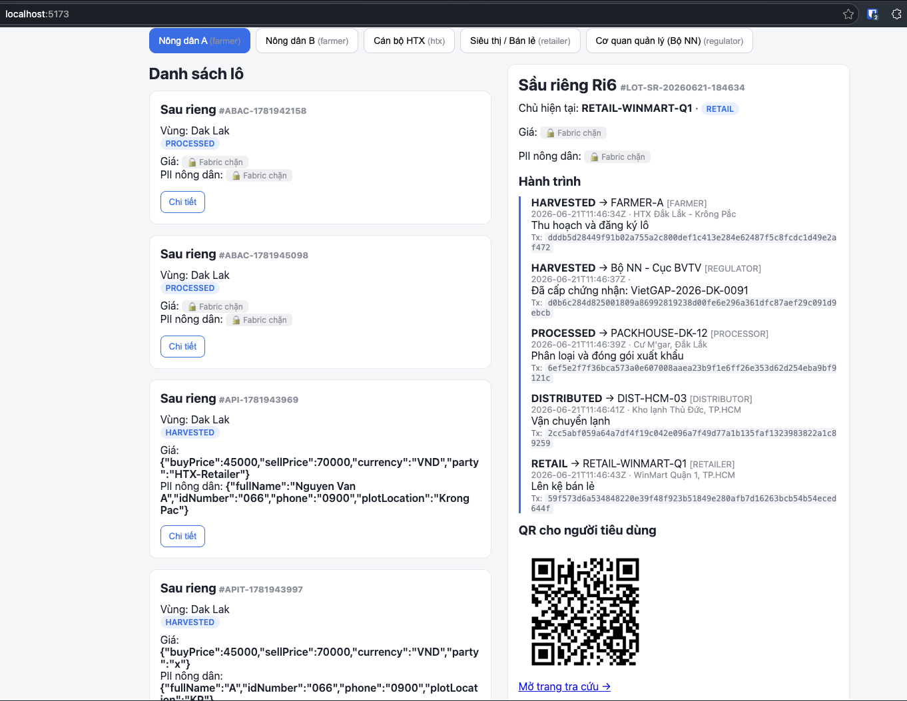
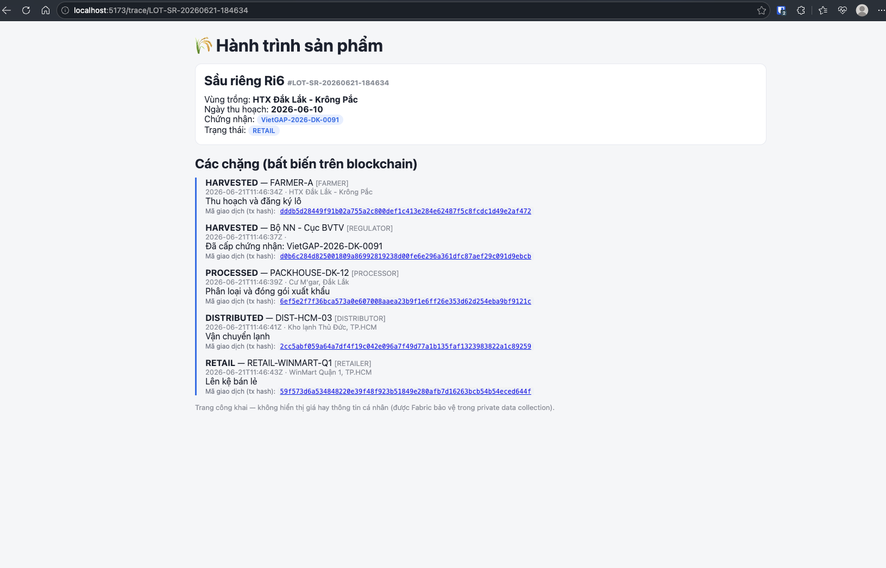
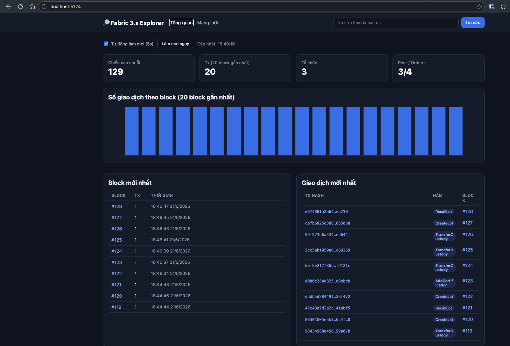
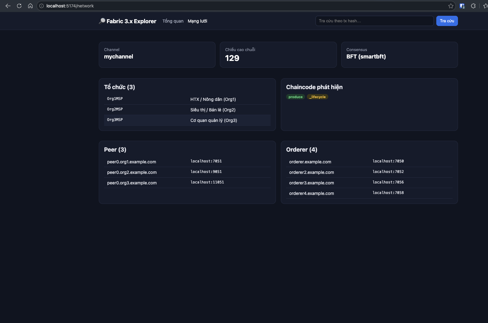
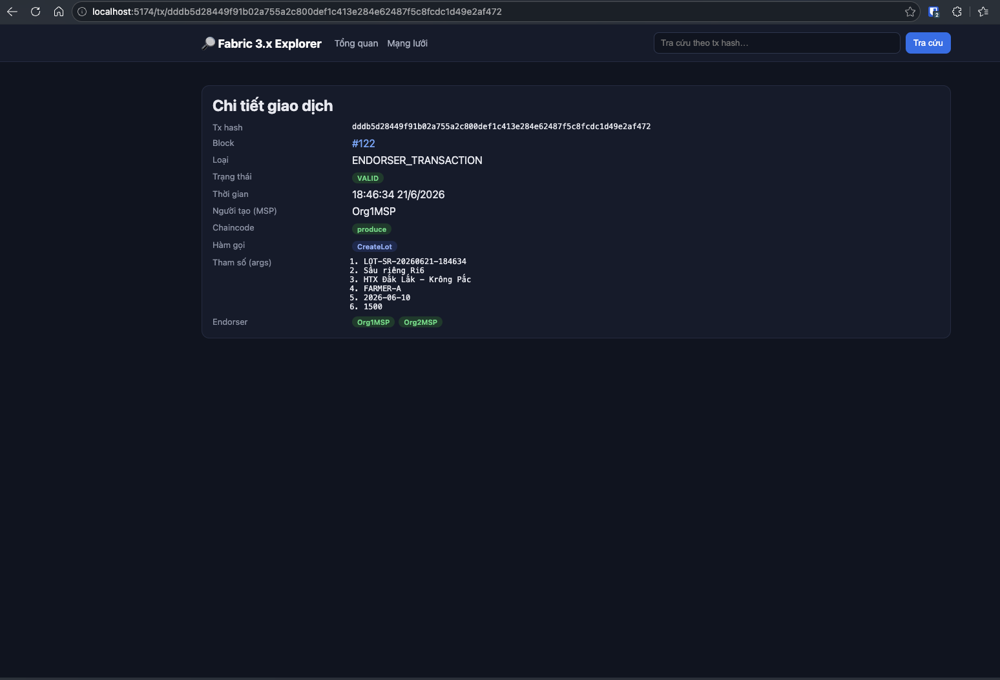

# Agricultural Produce Traceability on Hyperledger Fabric 3.x

A produce traceability solution built on a permissioned **Hyperledger Fabric 3.1.5** network (**BFT / SmartBFT** consensus, 4 orderers, 3 organizations). It has three parts:

- **Fabric network** — the `produce` chaincode records the full lifecycle of a produce lot (create → certify → pack → distribute → retail) as immutable history events. Sensitive data is protected with **Private Data** (price, farmer PII) and user-level access is enforced with **ABAC**.
- **Traceability app** (`app/`) — REST API + React UI: pick a role to see only the data you are allowed to (enforced by Fabric, not hidden in the UI), plus a QR code linking to a public lookup page for consumers.
- **Explorer** (`explorer/`) — a custom explorer for Fabric 3.x (qscc + fabric-gateway), replacing Hyperledger Explorer which does not support Fabric 3.x.

## Screenshots

### Traceability app

Lot list — pick a role; confidential fields show 🔒 when Fabric blocks access:



Lot detail — full provenance trail + consumer QR code:




### Blockchain Explorer (Fabric 3.x)

Network overview — chain height, transactions per block, latest blocks & transactions:




Transaction detail — tx hash, chaincode, invoked function, arguments, endorsers:



## Quick start

```bash
# 1. Start the BFT network + Org3 + deploy chaincode
cd fabric-samples/test-network
./network.sh up createChannel -bft -ca -c mychannel
cd addOrg3 && ./addOrg3.sh up -c mychannel -ca && cd ..
./network.sh deployCC -ccn produce -ccp ../../chaincode/produce-traceability -ccl go -c mychannel

# 2. Register identities + run the app
bash scripts/register-users.sh
cd app/server && npm install && node server.js   # API :3000
cd app/web && npm install && npm run dev          # UI  :5173

# 3. Run the explorer (server :3001 + web :5174)
cd explorer/server && npm install && npm start
cd explorer/web && npm install && npm run dev
```

> Detailed guides: app — [app/web/RUN.md](app/web/RUN.md), explorer — [explorer/RUN.md](explorer/RUN.md).
